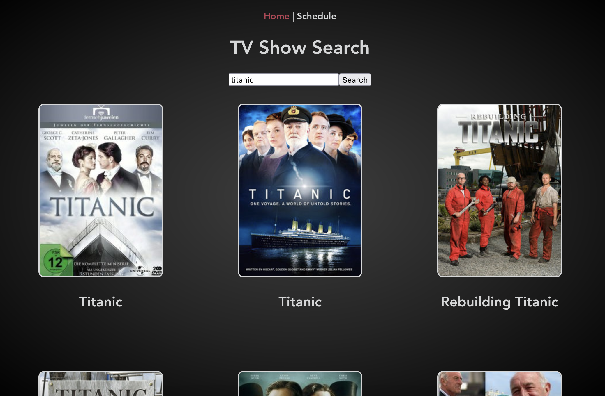

TV-Search-App

A search app used to search for TV shows and TV show details.

## Table of contents

- [Overview](#overview)
  - [Screenshot](#screenshot)
  - [Links](#links)
- [My process](#my-process)
  - [Built with](#built-with)
  - [What I learned](#what-i-learned)
  - [Continued development](#continued-development)
- [Author](#author)

## Overview

### Screenshot

### Links

- Solution URL: [GitHub Project Page](https://github.com/micamash/tv-search-app)
- Live Site URL: [TV Search App]()

### Built with
-HTML
-CSS
-JavaScript
-Vue
-[TV Maze API](https://www.tvmaze.com/api)

### What I learned
This was my first project using Vue and an API. I learned a lot during this project. It has helped me solidify my understanding of how Vue works.

### Continued development

I plan on adding a 'Schedule' nav that will show current air time schedules.

I look forward to creating more applications using APIs. I would also like to build a larger project using Vue to continue my development with that framework.

## Author

- Website - [My GitHub](https://github.com/micamash)
